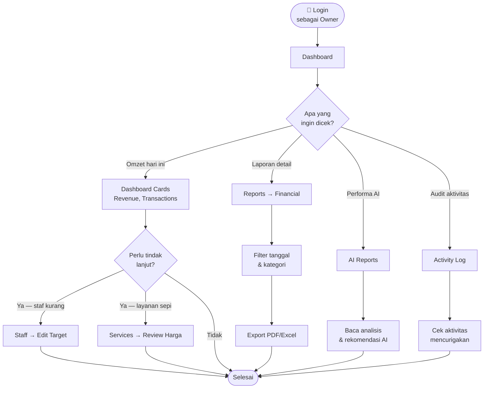
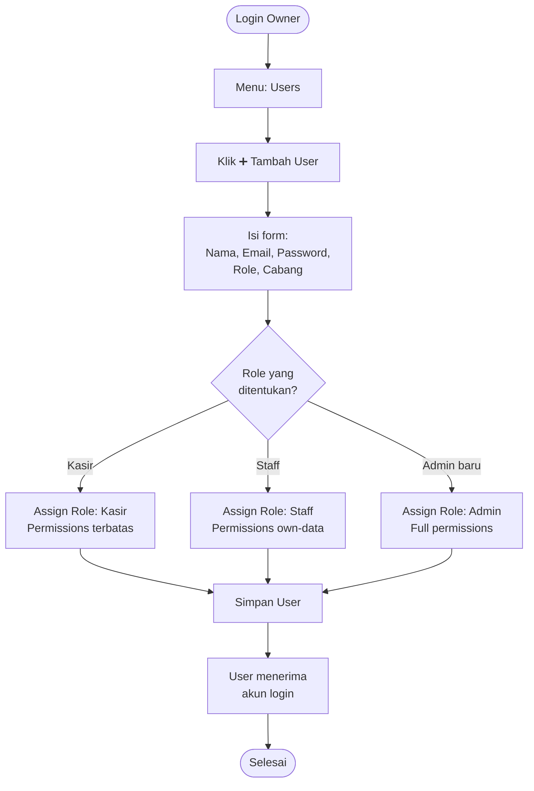
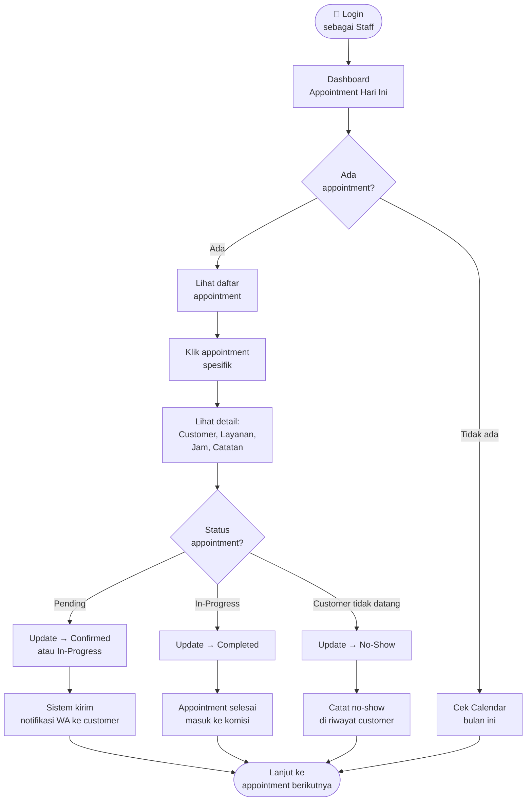
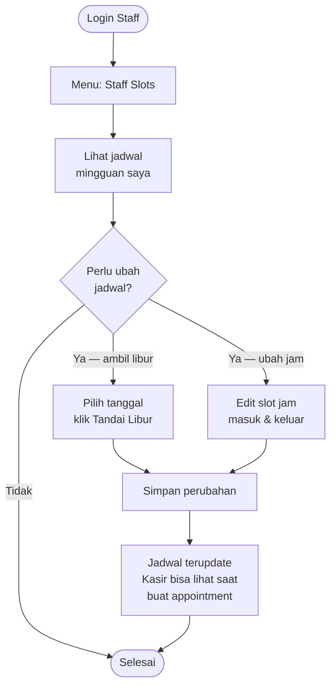
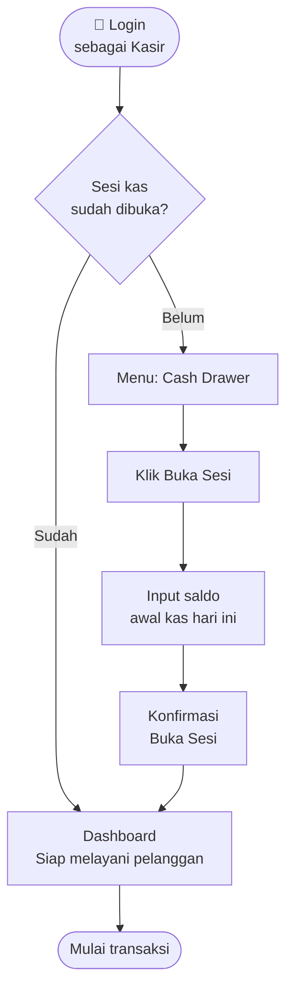
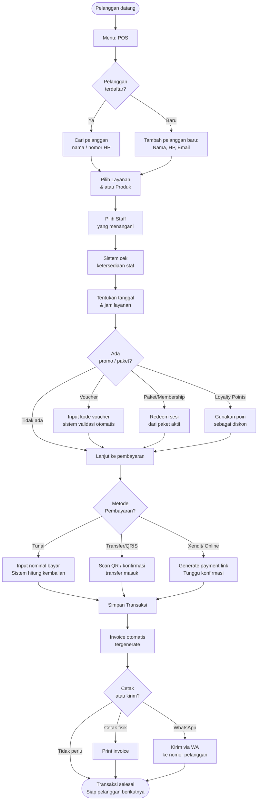
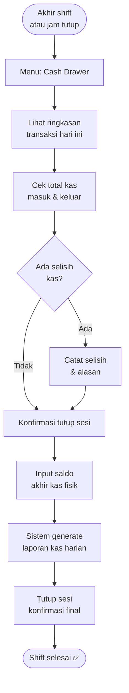
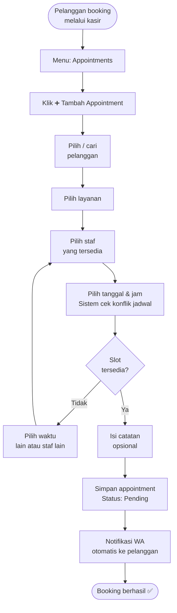

# 🎭 Persona Guide — SalonNext POS
> Panduan penggunaan web aplikasi **SalonNext** berdasarkan peran pengguna

---

## Daftar Isi
1. [Gambaran Umum Sistem](#gambaran-umum)
2. [Persona 1: Owner (Pemilik)](#persona-owner)
3. [Persona 2: Staff (Terapis/Stylist)](#persona-staff)
4. [Persona 3: Kasir (Resepsionis)](#persona-kasir)
5. [Matriks Akses Fitur](#matriks-akses)

---

## Gambaran Umum Sistem {#gambaran-umum}

**SalonNext** adalah sistem manajemen salon berbasis web (multi-tenant) yang mencakup:
- Point of Sale (POS) transaksi langsung
- Manajemen appointment & jadwal
- Laporan keuangan & AI Reports
- Manajemen staf & payroll
- CRM pelanggan (loyalitas, membership, paket)
- WhatsApp Marketing & notifikasi otomatis
- Manajemen kas & inventory

Setiap cabang salon memiliki database mandiri. Akses fitur diatur oleh sistem **RBAC** (Role-Based Access Control) yang fleksibel.

---

## Persona 1: Owner (Pemilik) {#persona-owner}

### 👤 Profil

| Atribut | Detail |
|---|---|
| **Nama Fiktif** | Budi Hartono |
| **Usia** | 38 tahun |
| **Role Sistem** | `Super Admin` / `Admin` |
| **Perangkat** | Laptop + Smartphone |
| **Frekuensi Login** | 1–2x sehari, bisa remote |
| **Tujuan Utama** | Memantau bisnis & mengambil keputusan strategis |

### 🎯 Goals (Tujuan)

- Melihat performa bisnis secara keseluruhan (omzet, transaksi, tren)
- Memantau kinerja dan komisi staf
- Mengelola pengaturan sistem, cabang, dan hak akses pengguna
- Menganalisis laporan keuangan & prediksi AI
- Mengelola layanan, produk, membership, dan paket
- Mengekspor data untuk kebutuhan akuntansi/pembukuan

### 😤 Pain Points (Kendala)

- Butuh gambaran bisnis cepat tanpa harus membuka banyak menu
- Tidak ingin repot dengan detail teknis sehari-hari
- Perlu trust pada sistem: data akurat, tidak bisa dimanipulasi staf/kasir
- Laporan harus bisa diakses kapan saja, termasuk dari ponsel

### 🔑 Fitur yang Diakses

```
✅ Dashboard              — Overview omzet, appointment hari ini, grafik tren
✅ Reports → Financial    — Laporan keuangan, revenue, profit
✅ Reports → AI Reports   — Analisis cerdas berbasis AI
✅ Reports → Activity Log — Audit trail seluruh aktivitas sistem
✅ Staff                  — Tambah/edit/hapus data staf
✅ Payroll                — Hitung & kelola gaji + komisi staf
✅ Users & Roles          — Kelola akun pengguna & hak akses
✅ Services               — Manajemen layanan & kategori
✅ Products               — Manajemen produk (jual & pakai)
✅ Membership             — Buat & kelola program keanggotaan
✅ Packages               — Paket layanan bundling
✅ Vouchers               — Promo & diskon
✅ Settings               — Konfigurasi toko, WhatsApp, integrasi
✅ Import / Export        — Backup & migrasi data
✅ Admin Cabang           — Manajemen multi-tenant (Super Admin only)
✅ WA Marketing           — Blast promosi WhatsApp ke pelanggan
```

### 🗺️ Userflow: Owner — Cek Laporan Harian



### 🗺️ Userflow: Owner — Setup Pengguna Baru



---

## Persona 2: Staff (Terapis / Stylist) {#persona-staff}

### 👤 Profil

| Atribut | Detail |
|---|---|
| **Nama Fiktif** | Susi Pratiwi |
| **Usia** | 26 tahun |
| **Role Sistem** | `Staff` (custom role, view: `own`) |
| **Perangkat** | Smartphone (dominan) |
| **Frekuensi Login** | Setiap hari kerja, saat shift mulai |
| **Tujuan Utama** | Lihat jadwal & kelola appointment sendiri |

### 🎯 Goals (Tujuan)

- Melihat daftar appointment yang ditugaskan untuk dirinya hari ini
- Mengupdate status appointment (konfirmasi, selesai, no-show)
- Melihat detail customer: catatan layanan sebelumnya, preferensi
- Melihat riwayat komisi dan pendapatan sendiri
- Mengelola slot jadwal ketersediaan diri (jam kerja / libur)

### 😤 Pain Points (Kendala)

- Tidak perlu (dan tidak boleh) lihat data staf lain atau laporan keuangan
- Harus bisa tahu jadwal dengan cepat, tanpa loading lambat
- Takut salah input dan merusak data pelanggan
- Butuh notifikasi/reminder appointment dari sistem

### 🔑 Fitur yang Diakses

```
✅ Dashboard (terbatas)   — Hanya appointment milik sendiri hari ini
✅ Appointments (own)     — Lihat & update status appointment sendiri
✅ Calendar View          — Visualisasi jadwal dalam tampilan kalender
✅ Customers (view)       — Lihat detail customer yang ditangani
✅ Staff Slots            — Atur jam kerja & hari libur sendiri
✅ Profile                — Update data diri & foto profil
❌ Reports                — Tidak bisa akses laporan bisnis
❌ Users / Roles          — Tidak bisa kelola akun lain
❌ Settings               — Tidak bisa mengubah konfigurasi sistem
❌ Payroll (view-only)    — Hanya bisa lihat komisi diri sendiri (opsional)
```

### 🗺️ Userflow: Staff — Memulai Shift & Cek Jadwal



### 🗺️ Userflow: Staff — Kelola Jadwal Ketersediaan



---

## Persona 3: Kasir (Resepsionis) {#persona-kasir}

### 👤 Profil

| Atribut | Detail |
|---|---|
| **Nama Fiktif** | Dewi Rahmawati |
| **Usia** | 23 tahun |
| **Role Sistem** | `Kasir` (custom role) |
| **Perangkat** | Desktop / Tablet di meja kasir |
| **Frekuensi Login** | Setiap hari, sepanjang jam buka toko |
| **Tujuan Utama** | Proses transaksi cepat & kelola operasional harian |

### 🎯 Goals (Tujuan)

- Membuka/menutup sesi kas setiap hari dengan benar
- Memproses transaksi POS secara cepat dan akurat
- Membuat dan mengelola appointment untuk pelanggan
- Mendata pelanggan baru & memperbarui informasi pelanggan lama
- Mencetak/mengirim invoice ke pelanggan
- Redeem voucher, loyalty points, atau paket pelanggan
- Mencatat pengeluaran operasional harian

### 😤 Pain Points (Kendala)

- Antrian pelanggan yang panjang menuntut kecepatan transaksi
- Harus hafal banyak menu jika UI tidak intuitif
- Kesalahan input uang kembalian sangat kritis
- Pelanggan sering menanyakan promo, paket, atau saldo loyalty

### 🔑 Fitur yang Diakses

```
✅ Cash Drawer            — Buka/tutup sesi kas, catat transfer & pengeluaran
✅ POS                    — Transaksi langsung: pilih layanan/produk, bayar
✅ Appointments           — Buat, lihat, & update appointment semua staf
✅ Customers              — Tambah pelanggan baru, lihat riwayat & saldo
✅ Invoices               — Lihat, cetak, dan kirim invoice
✅ Expenses               — Input pengeluaran operasional harian
✅ Vouchers (redeem)      — Terapkan voucher diskon saat transaksi
✅ Packages (redeem)      — Redeem sesi dari paket layanan pelanggan
✅ Membership (redeem)    — Cek & gunakan manfaat membership
✅ Wallet / Loyalty       — Lihat & gunakan saldo poin pelanggan
✅ Dashboard (terbatas)   — Summary transaksi hari ini
❌ Reports keuangan       — Tidak bisa akses laporan bisnis detail
❌ Staff / Payroll        — Tidak bisa ubah data staf atau gaji
❌ Settings               — Tidak bisa mengubah konfigurasi sistem
❌ Users / Roles          — Tidak bisa kelola akun pengguna lain
```

### 🗺️ Userflow: Kasir — Membuka Shift & Sesi Kas



### 🗺️ Userflow: Kasir — Proses Transaksi POS



### 🗺️ Userflow: Kasir — Tutup Shift & Kas



### 🗺️ Userflow: Kasir — Buat Appointment Baru



---

## Matriks Akses Fitur {#matriks-akses}

| Fitur / Modul | Owner | Staff | Kasir |
|---|:---:|:---:|:---:|
| **Dashboard** | ✅ Full | ✅ Terbatas (own) | ✅ Terbatas |
| **POS (Point of Sale)** | ✅ | ❌ | ✅ |
| **Appointments** | ✅ Semua | ✅ Own only | ✅ Semua |
| **Calendar View** | ✅ | ✅ | ✅ |
| **Customers (CRUD)** | ✅ | ✅ View only | ✅ |
| **Customer Wallet/Loyalty** | ✅ | ❌ | ✅ View |
| **Invoices** | ✅ | ❌ | ✅ View/Print |
| **Cash Drawer** | ✅ | ❌ | ✅ |
| **Expenses** | ✅ | ❌ | ✅ |
| **Services (CRUD)** | ✅ | ❌ | ❌ View |
| **Products (CRUD)** | ✅ | ❌ | ❌ View |
| **Vouchers** | ✅ | ❌ | ✅ Redeem |
| **Packages** | ✅ | ❌ | ✅ Redeem |
| **Membership** | ✅ | ❌ | ✅ Redeem |
| **Staff (CRUD)** | ✅ | ❌ | ❌ |
| **Staff Slots** | ✅ | ✅ Own only | ❌ View |
| **Payroll** | ✅ | ❌ View own | ❌ |
| **Reports → Financial** | ✅ | ❌ | ❌ |
| **Reports → AI Reports** | ✅ | ❌ | ❌ |
| **Reports → Activity Log** | ✅ | ❌ | ❌ |
| **Purchases / Suppliers** | ✅ | ❌ | ❌ |
| **Usage Logs** | ✅ | ❌ | ❌ |
| **Bundles** | ✅ | ❌ | ❌ |
| **WA Marketing / Templates** | ✅ | ❌ | ❌ |
| **Import / Export** | ✅ | ❌ | ❌ |
| **Users & Roles (CRUD)** | ✅ | ❌ | ❌ |
| **Settings** | ✅ | ❌ | ❌ |
| **Admin Cabang** | ✅ Super Admin | ❌ | ❌ |

---

## Catatan Penting untuk Implementasi

1. **Role bersifat kustom** — Owner dapat membuat role baru dengan kombinasi izin apapun melalui menu `Roles`. Persona di atas adalah template default yang direkomendasikan.

2. **View scope `own` vs `all`** — Staff hanya melihat data miliknya sendiri. Kasir dan Owner melihat data semua (`all`). Ini dikontrol pada level RBAC di setiap API route.

3. **Notifikasi WhatsApp otomatis** — Sistem mengirim notifikasi ke pelanggan saat appointment dibuat, dikonfirmasi, mendekati jadwal (reminder), dan selesai. Kasir/Owner tidak perlu kirim manual.

4. **Multi-cabang** — Jika salon memiliki lebih dari satu cabang, setiap cabang memiliki login URL tersendiri (`/[slug]/login`). Owner dapat memantau semua cabang dari panel Admin Cabang (Super Admin).

5. **PIN Cash Drawer** — Sesi kas dilindungi PIN khusus. Pastikan PIN diubah dari default `123456` di menu Settings sebelum produksi.

---

*Dokumen ini dibuat berdasarkan analisis source code SalonNext — versi Mei 2026.*
